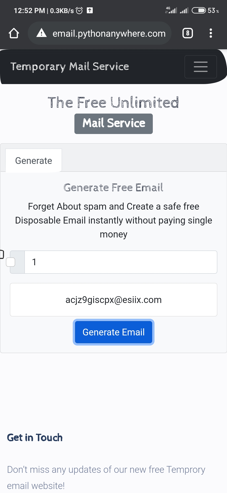
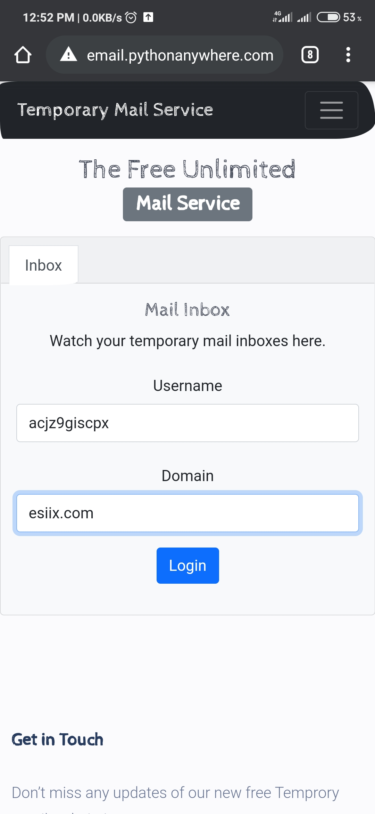

# Temporary_mail

 A Temprorary Mail creator

<h2> Introduction</h1>

 This is a simple website for them who wants to create Temporary
  disposable Mail for them.

This website is working on https://www.1secmail.com/api/ Api for creating random temporary websites. Just Hit Generate Button Get ur temporary mail address username and domain and now u can check ur meesage in Inbox Option.

<h1> Usage </h1>

 This is a short tutorial on how to use disposable mail website.

Go on Temprorary mail website By clicking here http://disposablemail.pythonanywhere.com. Now u can see Generate Email option just click there

</img>

 After click on Generate Email copy ur username and Domain Go to Inbox Section and Paste ur username and domain

</img>

 Now u can check all ur mails that u got in ur inbox in ur temproary mail 

<h1> Credit</h1>

 Thanks for giving time on this repo kindly contact t.me/gadgethackerofficial for any queries or any suggestions or feedbacks if you found and bug please create a pull request

 Kidnly Check 1secmail Api for further details

